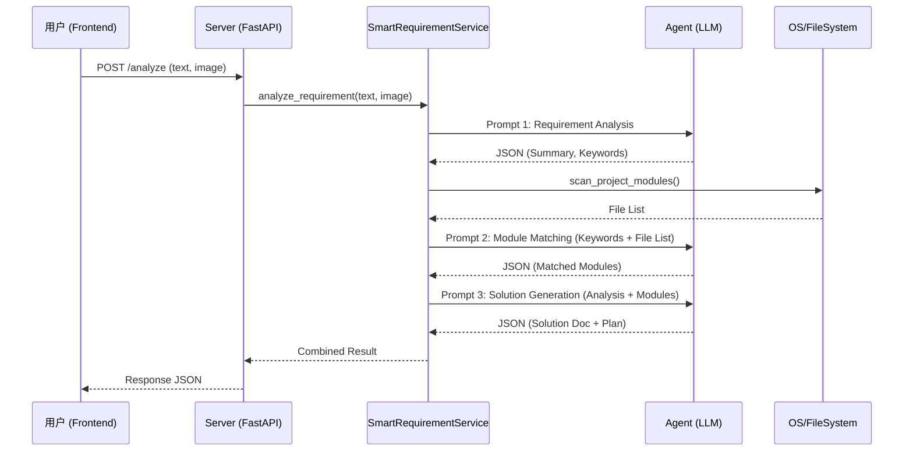

# 智能需求分析系统架构与影响分析报告

## 1. 需求关联分析

### 1.1 核心功能模块映射
当前系统通过以下模块协作实现需求分析功能：

```mermaid
graph TD
    UserReq[用户需求输入] --> Frontend[SmartRequirementAnalysis Component]
    Frontend --> API[后端 API (server.py)]
    API --> Service[SmartRequirementService]
    Service --> Agent[Agent Core (LLM)]
    Service --> FS[File System Scanner]
    
    subgraph "核心关联模块"
        Service
        Agent
        API
    end
    
    subgraph "外部依赖"
        LLM[LLM Provider]
        ProjectFiles[项目源代码]
    end
    
    Agent --> LLM
    FS --> ProjectFiles
```

### 1.2 模块职责清单
*   **Frontend (`SmartRequirementAnalysis.jsx`)**: 负责用户交互、图片上传预览、Markdown 渲染及执行计划可视化。
*   **Backend API (`server.py`)**: 提供 RESTful 接口，处理请求路由和错误捕获。
*   **Core Service (`smart_requirement_service.py`)**: 
    *   `analyze_requirement`: 调用 LLM 进行语义理解。
    *   `match_modules`: 扫描文件系统并调用 LLM 进行相关性匹配。
    *   `generate_solution`: 综合上下文生成最终方案。
*   **Agent (`agent.py`)**: 封装 LLM 调用逻辑，管理 Prompt 和对话历史。

---

## 2. 接口文档 (Interface Documentation)

### 2.1 核心分析接口

*   **接口名称**: 智能需求分析 (Analyze Smart Requirement)
*   **唯一标识**: `POST /api/smart-requirement/analyze`
*   **功能描述**: 接收文本和图片上下文，执行全链路分析并返回结构化结果。

#### 请求参数 (Request)
| 字段 | 类型 | 必填 | 说明 | 示例 |
| :--- | :--- | :--- | :--- | :--- |
| `text` | string | 是 | 需求描述文本 | "增加一个积分商城功能" |
| `image_path` | string | 否 | 上传图片的相对路径 | "uploads/design.png" |
| `project_name` | string | 否 | 目标项目名称 | "my-project" |

#### 响应结构 (Response)
```json
{
  "success": true,
  "analysis": {
    "summary": "需求摘要...",
    "type": "Web",
    "keywords": ["React", "API"],
    "complexity_score": 5,
    "key_features": ["积分展示", "兑换流程"],
    "tech_constraints": ["需兼容移动端"]
  },
  "matched_modules": [
    {
      "path": "backend/core/mall_service.py",
      "relevance_score": 85,
      "reason": "包含商品管理逻辑"
    }
  ],
  "solution_doc": "# 技术方案\n...",
  "execution_plan": {
    "milestones": [...],
    "risks": [...]
  }
}
```

#### 性能指标
*   **QPS 限制**: 依赖于 LLM Provider (通常建议 < 60 RPM)。
*   **响应时间**: 
    *   纯文本: Avg 10-15s
    *   带图片: Avg 20-30s (取决于 Vision 模型处理时间)
*   **超时设置**: 建议客户端设置超时时间为 60s。

---

## 3. 业务流程梳理

### 3.1 完整调用时序图



### 3.2 异常处理机制
1.  **参数校验**: 若 `text` 为空且无图片，前端拦截；后端返回 400。
2.  **LLM 失败**: 若 LLM 调用超时或返回非 JSON 格式，Service 层捕获异常，返回包含 `raw_response` 的降级结果或 500 错误。
3.  **文件扫描**: 若项目路径不存在，忽略模块匹配步骤，仅进行纯理论分析。

---

## 4. 影响评估报告

### 4.1 关键依赖项
*   **LLM API**: 系统的核心大脑。若 API Key 失效或额度耗尽，功能完全不可用。
*   **文件系统权限**: 需要读取项目目录的读权限以扫描模块。

### 4.2 上下游影响
*   **上游**: 无直接上游系统调用此接口。
*   **下游**: 
    *   **TaskMaster**: 未来生成的 `execution_plan` 可直接导入 TaskMaster 生成具体任务（当前为解耦状态）。
    *   **CI/CD**: 生成的方案可能建议新的 CI/CD 配置。

### 4.3 稳定性风险
*   **Token 溢出**: 若项目文件过多，扫描出的文件列表可能超出 LLM Context Window。
    *   *缓解措施*: 目前仅扫描顶层和二级目录，未来需引入 RAG 或 Token 截断逻辑。
*   **响应延迟**: 长时间的 HTTP 请求可能导致前端 Gateway (如 Nginx) 超时。
    *   *缓解措施*: 建议未来改为 WebSocket 或 轮询模式。

---

## 5. 版本对比展示

### 5.1 变更概览
本功能为 **新增特性 (Net-New Feature)**，与旧版本无直接冲突。

| 维度 | 旧版本 (v1.0) | 新版本 (v1.1 - Smart Req) |
| :--- | :--- | :--- |
| **需求输入** | 仅支持聊天窗口文本 | 专用界面，支持结构化文本 + 图片 |
| **模块关联** | 无 (需人工搜索) | AI 自动扫描 + 语义匹配 |
| **方案生成** | 聊天对话流 | 结构化 Markdown 文档 + 甘特图数据 |
| **API** | `/chat` | 新增 `/api/smart-requirement/analyze` |

### 5.2 潜在冲突点
*   **无代码冲突**: 新增文件独立 (`smart_requirement_service.py`, `SmartRequirementAnalysis.jsx`)。
*   **依赖冲突**: 无新增第三方 Python 库依赖。
