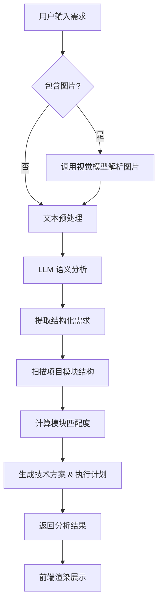
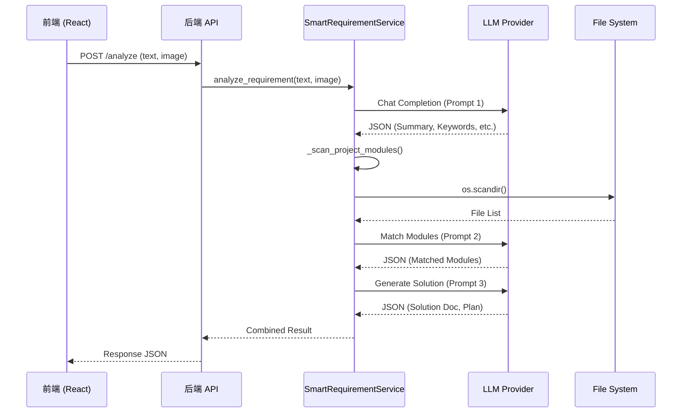
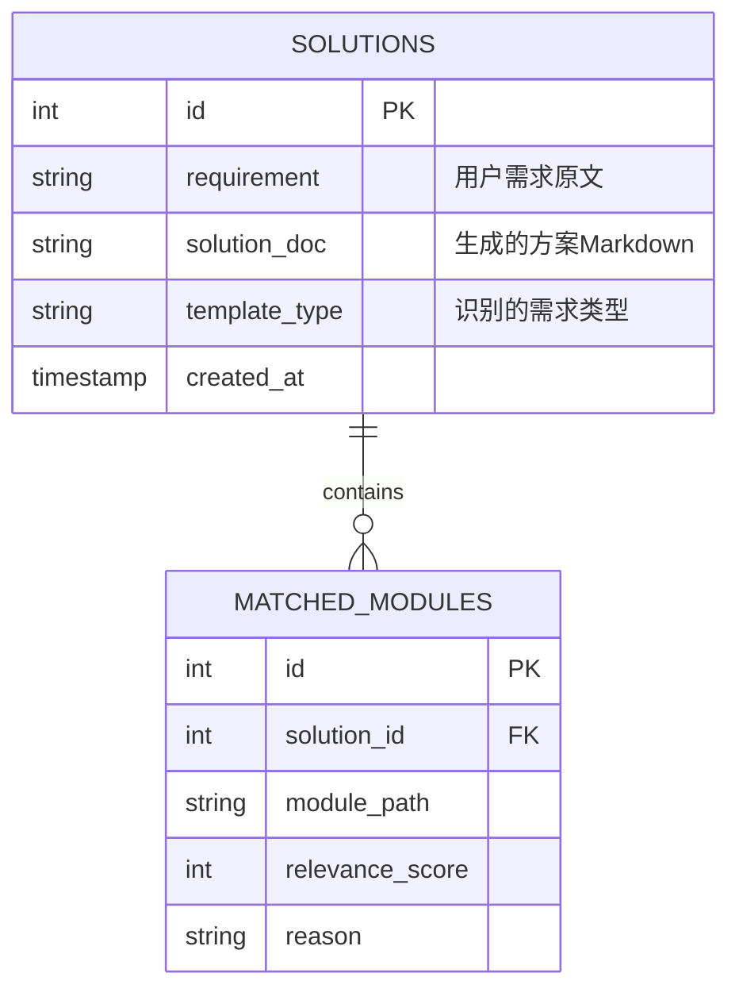

# 智能需求分析系统业务规格说明书

## 1. 业务流程图

本系统通过 AI 智能分析用户输入的需求描述，自动匹配项目现有模块，并生成可执行的技术方案。

### 流程说明
1.  **用户输入**：支持纯文本描述或文本+图片（设计图/原型图）。
2.  **多模态解析**：若包含图片，先通过 Vision 模型提取 UI 元素和布局信息作为上下文。
3.  **语义分析**：使用 LLM 提取需求的关键要素（类型、关键词、复杂度）。
4.  **模块关联**：基于提取的关键词，动态扫描当前项目结构，寻找相关度高的现有模块。
5.  **方案生成**：结合需求分析和匹配模块，生成 Markdown 格式的技术方案和 JSON 格式的执行计划。

---

## 2. 接口清单

| 接口名称 | 方法 | URL | 版本 | 认证 |
| :--- | :--- | :--- | :--- | :--- |
| 智能需求分析 | POST | `/api/smart-requirement/analyze` | v1.0 | Bearer Token |

---

## 3. 接口功能需求

### 3.1 智能需求分析接口

*   **描述**：接收用户需求文本和图片信息，进行全链路分析。
*   **前置条件**：项目已加载，后端服务正常运行。
*   **后置条件**：返回结构化的分析结果，不持久化存储（当前版本）。
*   **业务逻辑**：
    1.  校验输入（文本或图片至少其一）。
    2.  调用 `SmartRequirementService.analyze_requirement` 获取需求画像。
    3.  调用 `SmartRequirementService.match_modules` 获取关联模块。
    4.  调用 `SmartRequirementService.generate_solution` 生成方案。
    5.  组装最终响应。

---

## 4. 接口调用关系 (时序图)

---

## 5. 参数规范

### 5.1 请求参数 (Request)

`Content-Type: application/json`

| 字段名称 | 类型 | 必填 | 说明 | 示例值 |
| :--- | :--- | :--- | :--- | :--- |
| `text` | String | 是 | 需求描述文本 | "添加一个用户登录功能，支持微信扫码" |
| `image_path` | String | 否 | 上传图片的路径（需先上传） | "/uploads/design_v1.png" |
| `project_name` | String | 否 | 当前项目名称 | "my-agent-project" |

### 5.2 响应参数 (Response)

`Content-Type: application/json`

| 字段名称 | 类型 | 说明 |
| :--- | :--- | :--- |
| `success` | Boolean | 请求是否成功 |
| `analysis` | Object | 需求分析结果 |
| `analysis.summary` | String | 需求摘要 (中文) |
| `analysis.type` | String | 需求类型 (Web/Mobile/etc.) |
| `analysis.keywords` | Array[String] | 关键技术词汇 |
| `analysis.complexity_score` | Integer | 复杂度 (1-10) |
| `matched_modules` | Array[Object] | 匹配的现有模块 |
| `matched_modules[].path` | String | 模块路径 |
| `matched_modules[].relevance_score` | Integer | 匹配度 (0-100) |
| `solution_doc` | String | 技术方案 (Markdown) |
| `execution_plan` | Object | 执行计划 |
| `execution_plan.milestones` | Array | 里程碑列表 |
| `execution_plan.risks` | Array | 风险列表 |

---

## 6. 异常处理

| 错误码 | 描述 | HTTP 状态码 | 处理建议 |
| :--- | :--- | :--- | :--- |
| `REQ_001` | 参数缺失 (文本和图片均为空) | 400 | 提示用户输入内容 |
| `PRJ_001` | 项目路径不存在 | 404 | 检查项目配置 |
| `LLM_001` | LLM 服务调用失败 | 503 | 重试或检查网络/Key |
| `LLM_002` | LLM 响应解析失败 (非 JSON) | 500 | 后端日志记录，返回降级结果 |

---

## 7. 性能指标

*   **响应时间**：
    *   纯文本分析：< 15秒 (取决于 LLM 生成速度)
    *   多模态分析：< 30秒
*   **并发能力**：取决于后端 Worker 数量和 LLM Provider 的 Rate Limit。建议客户端设置 60s 超时。
*   **缓存策略**：对于相同的 `text` + `image_path` 输入，建议在后端实现 LRU 缓存 (TTL 1小时)。

---

## 8. 数据库设计 (ER 图)

虽然核心分析是实时的，但为了支持历史记录回溯，建议设计如下数据模型：

---

## 9. 单元测试覆盖计划

| 测试模块 | 测试点 | 预期覆盖率 |
| :--- | :--- | :--- |
| `SmartRequirementService` | `analyze_requirement` JSON 解析健壮性 | 100% |
| `SmartRequirementService` | `match_modules` 文件扫描边界情况 | 90% |
| `SmartRequirementService` | `generate_solution` 上下文注入正确性 | 100% |
| API Endpoint | `/api/smart-requirement/analyze` 参数校验 | 100% |
